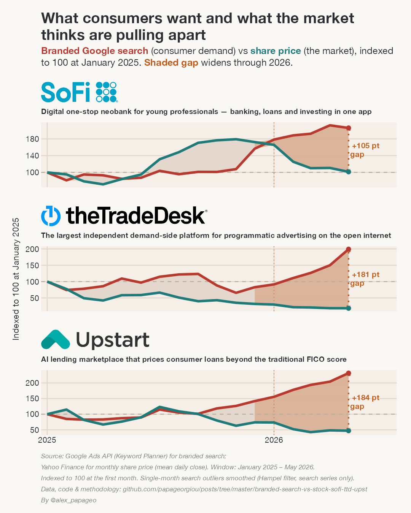

# Brand search vs. share price — SoFi, The Trade Desk, Upstart

A LinkedIn data visualization comparing **branded Google search demand** against the **share price** for three digital-first public companies, June 2022 to May 2026.

The idea is to look at the **gap between what the market thinks (share price) and what consumers want (branded search demand)** — and how that gap has widened recently. Each series is **rebased to 100 at the start of the window** (indexed overlay, single scale per company, no dual y-axis). The shaded area between the two lines is the gap; its 2026 portion is highlighted, and a dotted connector marks the gap at the final month (May 2026).

Two versions are rendered, differing only in the window / index base:

- `outputs/search_vs_stock_from2024.png` — indexed to January 2024
- `outputs/search_vs_stock_from2025.png` — indexed to January 2025



## The takeaway

Across all three companies, consumer demand (branded search) is running ahead of the share price, and the gap has widened month after month through 2026. The market is pricing these names well below where consumer interest sits.

Gap at the final month (May 2026), in index points (search index − price index):

| Ticker | Company | Indexed from Jan 2024 | Indexed from Jan 2025 |
|--------|---------|-----------------------|-----------------------|
| SOFI   | SoFi    | +79 pts  | +105 pts |
| TTD    | The Trade Desk | +399 pts | +181 pts |
| UPST   | Upstart | +126 pts | +184 pts |

## The companies

- **SoFi (SOFI)** — Digital one-stop neobank for young professionals; banking, loans and investing in one app.
- **The Trade Desk (TTD)** — The largest independent demand-side platform (DSP) for programmatic advertising on the open internet.
- **Upstart (UPST)** — AI lending marketplace that prices consumer loans beyond the traditional FICO score.

## Data and methodology

**Branded search volume.** Average monthly search volume from the Google Ads API (Keyword Planner historical metrics), United States, for a basket of branded search terms per company (e.g. `sofi login`, `the trade desk pricing`, `upstart loans`). Terms are classified as branded vs. non-branded and the branded volumes are summed to a single monthly series per company. Only branded search is plotted here.

**Share price.** Daily closing prices from Yahoo Finance, resampled to a monthly mean (the average of the daily closes within each calendar month). Prices are split/dividend adjusted.

**Outlier handling.** Google Ads Keyword Planner occasionally returns a single-month spike that is a reporting artifact rather than real demand — for example, The Trade Desk's branded search reads 10,490 in November 2024, against roughly 600–2,500 in the surrounding months and 590 the very next month. A Hampel filter (7-month window, 3 median-absolute-deviations) flags such points, with an added guard that only replaces a month if it is also at least 2.5x above/below its local median, so ordinary month-to-month noise is left untouched. Flagged points are replaced with the local median. This affects only the branded search series (one point, TTD Nov 2024); share prices are never altered.

**Indexing and the gap.** For each company and each series, the (outlier-corrected) value is divided by its value in the window's first month and multiplied by 100, so both lines start at 100. The dashed line at 100 marks that baseline. The shaded ribbon between the two lines is the gap; the portion from January 2026 onward is highlighted in orange to flag where it is widening, and a dotted connector at the final month is labelled with the gap in index points. Absolute end values are intentionally not labelled — the story is the gap and its recent direction, not the level versus a single base month.

**Windows.** Two versions are produced: January 2024 – May 2026, and January 2025 – May 2026. The underlying source data run June 2022 – May 2026 (48 aligned months).

The raw data were produced by an upstream pipeline (search-term generation, Google Ads volume fetch, yfinance price pull, and monthly alignment). See that pipeline for full provenance:
**github.com/papageorgiou/stock-trends**

## Reproduce

```bash
# from this folder
Rscript viz_search_vs_stock.R
```

Live post folder: **github.com/papageorgiou/posts/tree/master/branded-search-vs-stock-sofi-ttd-upst**

This reads the self-contained extract in `data/monthly_aligned_3companies.csv` (filtered from the upstream `monthly_aligned_data.csv`), embeds the company logos in `assets/logos/`, and writes both `outputs/search_vs_stock_from2024.png` and `outputs/search_vs_stock_from2025.png` (1080×1350, 150 dpi each).

R packages: `tidyverse`, `ggtext`, `ggthemes`, `ragg`, `magick` (logo prep).

## Files

```
viz_search_vs_stock.R                 chart + data-prep code
data/monthly_aligned_3companies.csv   monthly branded search + share price, 3 tickers
assets/logos/{sofi,ttd,upst}.png      company logos (trimmed, transparent)
outputs/search_vs_stock_from2024.png  chart indexed from Jan 2024
outputs/search_vs_stock_from2025.png  chart indexed from Jan 2025
```

## Credits

Style follows the Warm Ledger LinkedIn dataviz system. Company logos are property of their respective owners, used here for editorial identification.

By @alex_papageo
