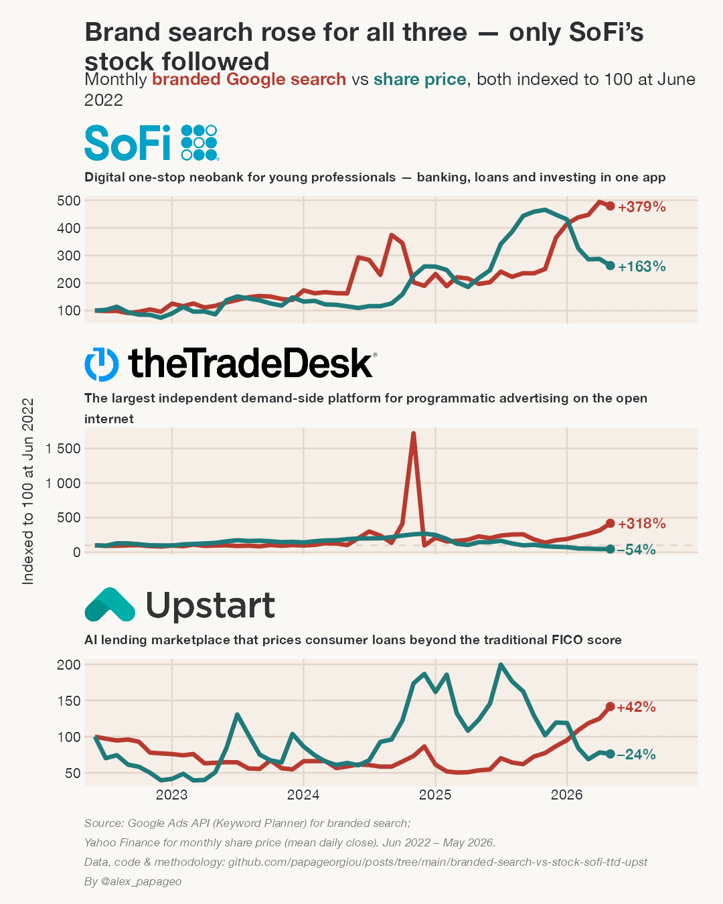

# Brand search vs. share price — SoFi, The Trade Desk, Upstart

A LinkedIn data visualization comparing **branded Google search demand** against the **share price** for three digital-first public companies, June 2022 to May 2026.

Both series are **rebased to 100 at June 2022** (indexed overlay), so the chart shows relative growth on a single scale per company — no dual y-axis.



## The takeaway

Branded search rose for all three companies over the period, but only SoFi's share price followed. For The Trade Desk and Upstart, brand search climbed while the stock fell.

| Ticker | Company | Branded search (vs Jun 2022) | Share price (vs Jun 2022) |
|--------|---------|------------------------------|---------------------------|
| SOFI   | SoFi    | +379% | +163% |
| TTD    | The Trade Desk | +318% | −54% |
| UPST   | Upstart | +42%  | −24% |

## The companies

- **SoFi (SOFI)** — Digital one-stop neobank for young professionals; banking, loans and investing in one app.
- **The Trade Desk (TTD)** — The largest independent demand-side platform (DSP) for programmatic advertising on the open internet.
- **Upstart (UPST)** — AI lending marketplace that prices consumer loans beyond the traditional FICO score.

## Data and methodology

**Branded search volume.** Average monthly search volume from the Google Ads API (Keyword Planner historical metrics), United States, for a basket of branded search terms per company (e.g. `sofi login`, `the trade desk pricing`, `upstart loans`). Terms are classified as branded vs. non-branded and the branded volumes are summed to a single monthly series per company. Only branded search is plotted here.

**Share price.** Daily closing prices from Yahoo Finance, resampled to a monthly mean (the average of the daily closes within each calendar month). Prices are split/dividend adjusted.

**Indexing.** For each company and each series, the value is divided by its June 2022 value and multiplied by 100, so every line starts at 100. The dashed line at 100 marks that baseline; end-of-line labels show the percentage change versus the baseline.

**Window.** June 2022 – May 2026 (48 aligned months).

The raw data were produced by an upstream pipeline (search-term generation, Google Ads volume fetch, yfinance price pull, and monthly alignment). See that pipeline for full provenance:
**github.com/papageorgiou/stock-trends**

## Reproduce

```bash
# from this folder
Rscript viz_search_vs_stock.R
```

This reads the self-contained extract in `data/monthly_aligned_3companies.csv` (filtered from the upstream `monthly_aligned_data.csv`), embeds the company logos in `assets/logos/`, and writes `outputs/search_vs_stock_sofi_ttd_upst.png` (1080×1350, 150 dpi).

R packages: `tidyverse`, `ggtext`, `ggthemes`, `ragg`, `magick` (logo prep).

## Files

```
viz_search_vs_stock.R                 chart + data-prep code
data/monthly_aligned_3companies.csv   monthly branded search + share price, 3 tickers
assets/logos/{sofi,ttd,upst}.png      company logos (trimmed, transparent)
outputs/search_vs_stock_sofi_ttd_upst.png   exported chart
```

## Credits

Style follows the Warm Ledger LinkedIn dataviz system. Company logos are property of their respective owners, used here for editorial identification.

By @alex_papageo
