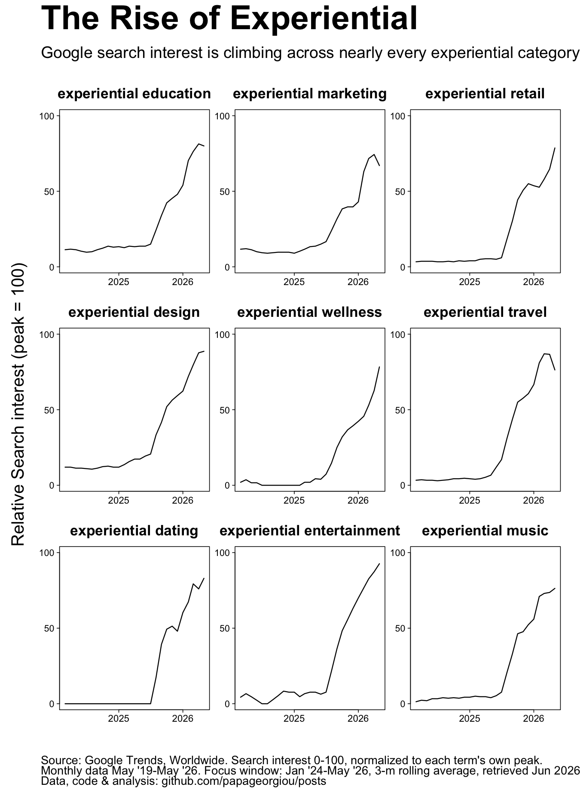

# The Rise of Experiential

Google search interest is climbing across nearly every "experiential X" category.
This folder analyses worldwide Google Trends search interest for nine experiential
niches and renders the result as plain, base-R small multiples.



## What's here

The data is monthly Google Trends search interest (0–100, normalized to each term's
own peak) for the search terms `experiential <niche>` across nine niches: education,
marketing, retail, design, wellness, travel, dating, entertainment, and music.

The focus window is January 2024 – May 2026, smoothed with a 3-month right-aligned
rolling average. Data retrieved June 2026.

## Files

| File | Description |
| --- | --- |
| `experiential_base.R` | Main script. Parses the markdown trend tables, computes the rolling average, and renders the plain base-R small multiples in three layouts (3x3, 3x2, 2x3), each with a standard and an XL-title variant. |
| `experiential_trends.R` | Earlier trend-extraction / exploration script. |
| `experiential_facets_v2.R` | Styled (ggplot) faceted version of the same data. |
| `make_mag_glass.R` | Helper that draws the `mag_glass.png` decorative element. |
| `Data/experiential * - Explore.md` | Raw Google Trends data, one markdown table per niche. |
| `experiential_base_3x3_xl.png` | Main image (shown above). |
| `experiential_base_3x3.png` | 3x3 layout, standard title size. |
| `Plots-Base/` | Additional base-R layouts (2x3 and 3x2, standard and XL). |

## Reproducing

Run the main script from this directory:

```r
source("experiential_base.R")
```

It reads the `Data/* - Explore.md` tables and writes the six `experiential_base_*.png`
files. No external packages are required — it is deliberately plain base R.

## Source

Source: Google Trends, Worldwide. Search interest 0–100, normalized to each term's
own peak. Monthly data May 2019 – May 2026; focus window Jan 2024 – May 2026,
3-month rolling average, retrieved June 2026.

Data, code & analysis: github.com/papageorgiou/posts
