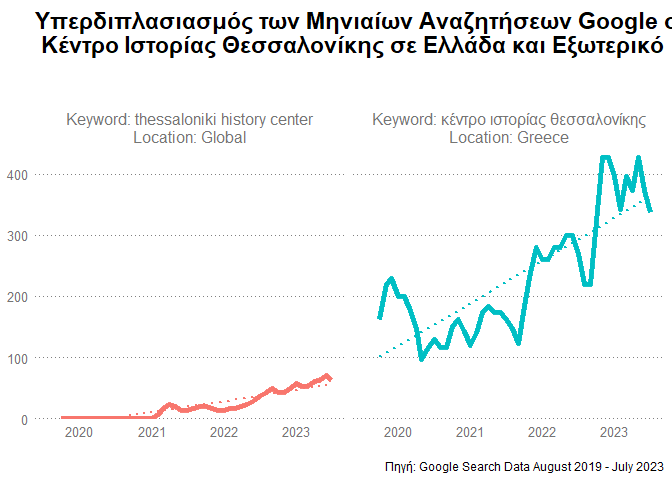

search data analysis: thessaloniki history center
================
Alex Papageorgiou
2023-09-05

``` r
lookup_locations <- tribble( 
  ~location_ids, ~location_name,
  '20377' ,          "Thessaloniki Region",
  "9061579" ,         "Thessaloniki City",
  "2840",            "USA",
  "0000",            "Global",
   "2300",            "Greece"
  
  )


lookup_lang <- tribble( 
  ~language_id, ~language_name,
  "1000",          "English",
  "1022",         "Greek")
```

# read data

``` r
search_terms <- read_csv(file="data/searchterms_kith.csv") 
```

    ## Rows: 10 Columns: 1
    ## -- Column specification --------------------------------------------------------
    ## Delimiter: ","
    ## chr (1): keyword
    ## 
    ## i Use `spec()` to retrieve the full column specification for this data.
    ## i Specify the column types or set `show_col_types = FALSE` to quiet this message.

``` r
kith_raw <- read_rds("data/res_df_raw_data.rds")

kith_unnested <- kith_raw  %>% unnest(results)

suggestions <- kith_unnested %>% 
  distinct(seed_term, keyword) %>% 
  arrange(seed_term) %>% 
  filter(!seed_term==keyword)

df <- kith_unnested %>% left_join(lookup_locations) %>% left_join(lookup_lang) %>% 
  select(keyword,location_name, language_name,  searches_past_months, avg_monthly_searches) 
```

    ## Joining with `by = join_by(location_ids)`
    ## Joining with `by = join_by(language_id)`

``` r
search_data <- kith_unnested %>% filter(avg_monthly_searches > 0)

start_month  <-  my(search_data$past_months[[1]][[1]])

##NOTE: get the first entry for "past_months" e.g. c("DECEMBER - 2017" etc
months_df <- tibble(month=ymd(start_month)+ months(0:47))


sd_long <- search_data %>% unnest_longer(searches_past_months) 


sd_monthly <- sd_long %>% 
  mutate(month=rep(months_df$month, len=nrow(sd_long)),
         month_counter=rep(1:48, len=nrow(sd_long))) %>%   #NOTE:len=nrow(.)
  mutate(year = year(month) + yday(month)/365 )  %>% 
  select(keyword, location_ids, language_id, searches_past_months , avg_monthly_searches, month_counter, month, year)
```

``` r
sd_month_filt <- sd_monthly %>% 
  group_by(keyword, location_ids, language_id) %>% 
  arrange(desc(year)) %>% 
  tidylog::filter(max(searches_past_months) > 0) %>% 
  tidylog::filter(keyword!="") 
```

    ## filter (grouped): no rows removed
    ## filter (grouped): no rows removed

``` r
rolling <- sd_month_filt  %>% 
  
  group_by(keyword, location_ids, language_id) %>% mutate(n=n()) %>% 
  arrange(year) %>% 
  mutate(roll_avg=zoo::rollmean(searches_past_months, 3, fill = NA, align = "right")) %>% 
  mutate(roll_avg_round=round(roll_avg,digits = 0)) %>% 
  ungroup()
```

``` r
keith <-  c("κιθ χάρινγκ", "κιθ ρίτσαρντς", "heartstopper κιθ κόννορ", "κιθ τζαρετ", "έργα τέχνης από κιθ χάρινγκ",
            "heartstopper κιθ κόννορ", "κιθ τζαρετ",
            "έργα τέχνης από κιθ χάρινγκ", "κιθ ρίτσαρντς βιβλιο", "salonika jewish history"  )
```

# substitute

``` r
replace_sigma <- function(text) {
  gsub("σ(?=\\s|$)", "ς", text, perl = TRUE)
}

# Apply the function to the 'greek_text' column
rolling$keyword <- sapply(rolling$keyword, replace_sigma)
```

# rolling

``` r
rolling_f <- rolling %>% filter(str_detect(keyword, "\\(", negate = T)) %>% 
  rename(Keyword=keyword) %>% 
  group_by(Keyword, location_ids, language_id) %>% mutate(id=cur_group_id()) %>% 
  left_join(lookup_locations) %>% left_join(lookup_lang) %>% 
  mutate(plot_title = glue::glue("Keyword: {Keyword} \n Location: {location_name}"))
```

    ## Joining with `by = join_by(location_ids)`
    ## Joining with `by = join_by(language_id)`

``` r
rolling_f_distinct <- rolling_f %>% distinct(Keyword, location_ids, language_id, id) %>% 
  left_join(lookup_locations) %>% left_join(lookup_lang) %>% 
  filter(!Keyword %in% keith) %>% arrange(id)
```

    ## Joining with `by = join_by(location_ids)`
    ## Joining with `by = join_by(language_id)`

# vars - ALL

``` r
caption_gr = " \n Πηγή: Google Search Data August 2019 - July 2023"
caption_en = " \n Source: Google Search Data August 2019 - July 2023"
```

# countries chart

``` r
countries_title_gr = "Ποσοστό Συνολικών Αναζητήσεων σχετικά με το Κέντρο Ιστορίας ανά Χώρα Προέλευσης Χρηστών \n "

countries_title_en = "Fraction of Total Searches about the History Center by Country of Origin \n "
```

``` r
by_country <- tribble(
  
  ~country,  ~share_of_searches, 
  "Greece",     0.4,
  "Germany",    0.1, 
  "Israel",    0.05,
  "Other countries",   0.35) 


# greek
  
by_country %>% mutate(country = fct_reorder(country, share_of_searches))  %>% 
ggplot(aes(x=country, y=share_of_searches, fill=country)) + geom_col()  +  
  coord_flip() + 
  scale_fill_brewer()  + 
  theme_alex() + theme(legend.position = "none") + 
  ggtitle(countries_title_gr) +
  labs(caption = caption_gr ) + 
  scale_y_continuous(labels = label_percent()) + xlab(label = NULL) + ylab(label=NULL)
```

<!-- -->

``` r
ggsave("countries_gr.png", height = 5 ,  width= 9)


# english

by_country %>% mutate(country = fct_reorder(country, share_of_searches))  %>% 
ggplot(aes(x=country, y=share_of_searches, fill=country)) + geom_col()  +  
  coord_flip() + 
  scale_fill_brewer()  + 
  theme_alex() + theme(legend.position = "none") + 
  ggtitle(countries_title_en) +
  labs(caption = caption_en ) + 
  scale_y_continuous(labels = label_percent()) + xlab(label = NULL) + ylab(label=NULL)
```

<!-- -->

``` r
ggsave("countries_en.png", height = 5 ,  width= 9)
```

# Geo GR

``` r
title_geo_gr <- "Μηνιαίες Αναζητήσεις Google σχ. με το Κέντρο Ιστορίας ανα Γεωγραφική Περιοχή Ενδιαφέροντος (Ελλάδα) \n "

title_geo_en <- "Monthly Google Searches about the History Center by Geo-location of Interest (Greece) \n "
```

``` r
rolling_f %>% filter(id %in% c(23, 24, 26))  %>%
#plot_by_category(n_rows = 1, colour_facet_group="title")
ggplot(aes(x=month, y=roll_avg_round, colour=plot_title)) +
geom_line(size = 1.5, alpha=0.9)+ theme_alex() +
xlab(label = NULL) + ylab(label = NULL) +  theme(legend.position = "top") +
labs(title= title_geo_gr , caption = caption_gr)
```

    ## Warning: Removed 6 row(s) containing missing values (geom_path).

<!-- -->

``` r
ggsave("geo_gr.png", height = 5 ,  width= 9)
```

    ## Warning: Removed 6 row(s) containing missing values (geom_path).

``` r
# EN
# 
rolling_f %>% filter(id %in% c(23, 24, 26))  %>%
#plot_by_category(n_rows = 1, colour_facet_group="title")
ggplot(aes(x=month, y=roll_avg_round, colour=plot_title)) +
geom_line(size = 1.5, alpha=0.9)+ theme_alex() +
xlab(label = NULL) + ylab(label = NULL) +  theme(legend.position = "top") +
labs(title= title_geo_en , caption = caption_en)
```

    ## Warning: Removed 6 row(s) containing missing values (geom_path).

<!-- -->

``` r
ggsave("geo_en.png", height = 5 ,  width= 9)
```

    ## Warning: Removed 6 row(s) containing missing values (geom_path).

# growth

``` r
title_growth_gr = "Υπερδιπλασιασμός των Mηνιαίων Aναζητήσεων Google σχετικά με το\n Κέντρο Ιστορίας Θεσσαλονίκης σε Ελλάδα και Eξωτερικό \n \n "

title_growth_en = "Monthly Google Searches about the History Center of Thessaloniki \n Over-double in Greece and Internationally \n \n "
```

``` r
rolling_f %>% filter(id %in% c(24, 5))  %>% 
  ggplot(aes(x=month, y=roll_avg_round, colour=plot_title)) + geom_line(size = 1.5)  +
  
  geom_line(alpha = 0.9, size = 1.8) +
    geom_smooth(method = "lm", se = F, linetype=3,  alpha=0.3) +
    expand_limits(y = NULL) +
    facet_wrap(vars(plot_title), nrow=1,   labeller = label_wrap_gen(width=40)) +

    scale_y_continuous(labels  = scales::comma_format(), expand = c(0, 0), limits = c(0, 450)) + 
  theme_alex()  +  xlab(label = NULL) + ylab(label = NULL) + 
  labs(title = title_growth_gr, caption = caption_gr)   +  
  theme(legend.position ="none" ) + 
  theme(plot.title = element_text(hjust = 0,  size = rel(1.5), face = "bold")) 
```

    ## `geom_smooth()` using formula 'y ~ x'

    ## Warning: Removed 4 rows containing non-finite values (stat_smooth).

    ## Warning: Removed 4 row(s) containing missing values (geom_path).
    ## Removed 4 row(s) containing missing values (geom_path).

    ## Warning: Removed 15 rows containing missing values (geom_smooth).

<!-- -->

``` r
  #
  #my_social_theme(strip_title_size=1) + scale_color_wsj()

ggsave("growth_gr.png", height = 5 ,  width= 9)
```

    ## `geom_smooth()` using formula 'y ~ x'

    ## Warning: Removed 4 rows containing non-finite values (stat_smooth).

    ## Warning: Removed 4 row(s) containing missing values (geom_path).
    ## Removed 4 row(s) containing missing values (geom_path).

    ## Warning: Removed 15 rows containing missing values (geom_smooth).

``` r
#EN 

rolling_f %>% filter(id %in% c(24, 5))  %>% 
  ggplot(aes(x=month, y=roll_avg_round, colour=plot_title)) + geom_line(size = 1.5)  +
  
  geom_line(alpha = 0.9, size = 1.8) +
    geom_smooth(method = "lm", se = F, linetype=3,  alpha=0.3) +
    expand_limits(y = NULL) +
    facet_wrap(vars(plot_title), nrow=1,   labeller = label_wrap_gen(width=40)) +
    scale_y_continuous(labels  = scales::comma_format(), expand = c(0, 0), limits = c(0, 450)) + 
  theme_alex()  +  xlab(label = NULL) + ylab(label = NULL) + 
  labs(title = title_growth_en, caption = caption_en)   +  
  theme(legend.position ="none" ) + 
  theme(plot.title = element_text(hjust = 0,  size = rel(1.5), face = "bold")) 
```

    ## `geom_smooth()` using formula 'y ~ x'

    ## Warning: Removed 4 rows containing non-finite values (stat_smooth).

    ## Warning: Removed 4 row(s) containing missing values (geom_path).
    ## Removed 4 row(s) containing missing values (geom_path).

    ## Warning: Removed 15 rows containing missing values (geom_smooth).

<!-- -->

``` r
ggsave("growth_en.png", height = 5 ,  width= 9)
```

    ## `geom_smooth()` using formula 'y ~ x'

    ## Warning: Removed 4 rows containing non-finite values (stat_smooth).

    ## Warning: Removed 4 row(s) containing missing values (geom_path).
    ## Removed 4 row(s) containing missing values (geom_path).

    ## Warning: Removed 15 rows containing missing values (geom_smooth).

# thess / region / GR / global one OR multi lines / one plot

# history center one line / one plot

# =================================================

# csv file save

# csv write

# vs kentriki
